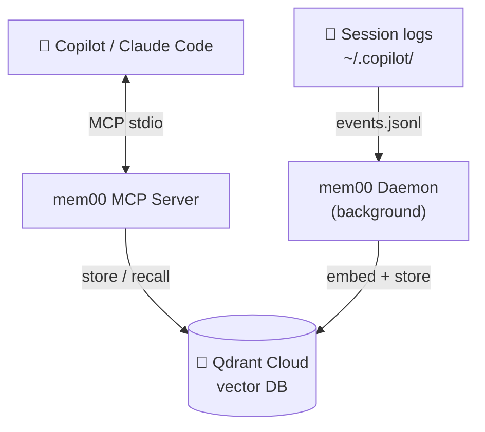
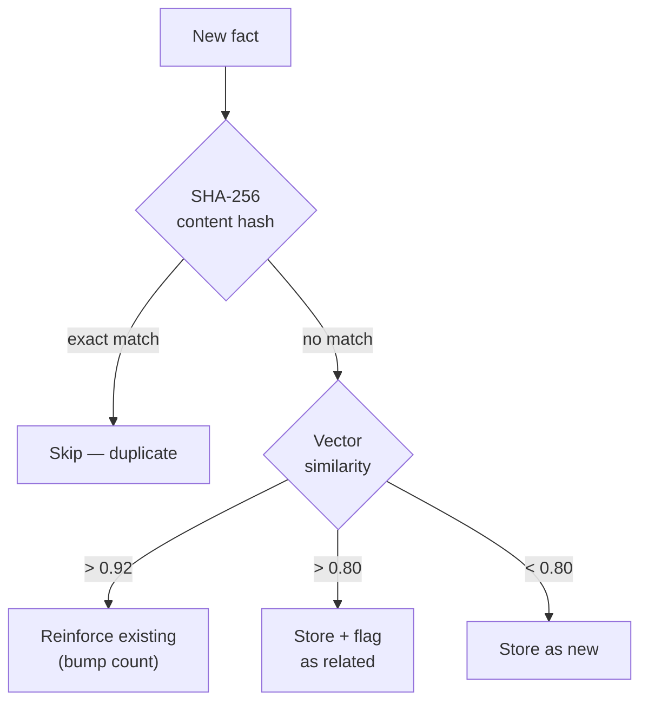
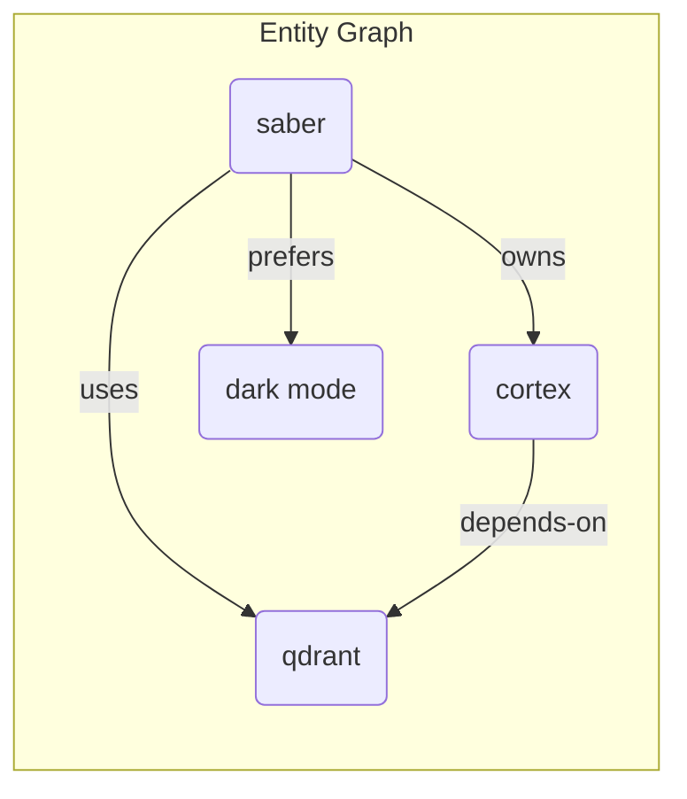
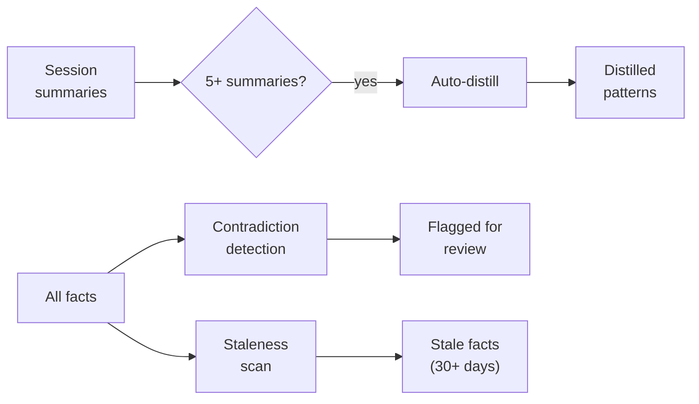

# mem00

**Shared persistent memory for AI coding sessions.**

mem00 gives your AI coding assistants (GitHub Copilot, Claude Code) long-term memory that persists across sessions. Facts, decisions, architecture knowledge, and entity relationships are stored in a vector database and recalled automatically.

## How it works



**MCP Server** — 12 memory tools your AI assistant can call directly:
- `memory_store` / `memory_recall` — store and search facts
- `memory_entity` / `memory_relations` — entity knowledge graph
- `memory_forget` / `memory_verify` — lifecycle management
- `memory_session_summary` / `memory_distill` — session consolidation
- `memory_heartbeat` — periodic reflection nudges

**Daemon** — background process that passively reads session logs:
- Watches `~/.copilot/session-state/` for new events
- Extracts facts via LLM from conversation transcripts
- Runs consolidation (distillation, contradiction detection)
- Infers entity relationships from co-occurring facts
- Scans for stale facts that need verification

## Quick start

```bash
# Install globally
npm install -g mem00

# Add to your editor's MCP config
mem00 install

# That's it — restart your editor and the memory tools appear
```

### Prerequisites

1. **Qdrant Cloud** (free tier: 1GB, no credit card)
   - Sign up at [cloud.qdrant.io](https://cloud.qdrant.io)
   - Create a cluster → copy the REST URL and API key

2. **Embedding provider** (one of):
   - **Ollama** (default, runs locally, free) — `brew install ollama && ollama pull qwen3-embedding:0.6b`
   - **OpenAI** — set `OPENAI_API_KEY` env var
   - **AWS Bedrock** — configure AWS credentials

### Setup

After installing, configure your Qdrant credentials. You can either:

**Option A** — Let your AI assistant do it:
```
> Call configure_credentials with my Qdrant URL and API key
```

**Option B** — Edit config directly:
```bash
cat > ~/.mem00/config.json << 'EOF'
{
  "qdrant_url": "https://your-cluster.cloud.qdrant.io:6333",
  "qdrant_api_key": "your-api-key-here"
}
EOF
```

**Option C** — Environment variables:
```bash
export QDRANT_URL="https://your-cluster.cloud.qdrant.io:6333"
export QDRANT_API_KEY="your-api-key-here"
```

## Configuration

Config lives at `~/.mem00/config.json`. Resolution order: **defaults → config file → env vars**.

| Setting | Env var | Default | Description |
|---------|---------|---------|-------------|
| `qdrant_url` | `QDRANT_URL` | — | Qdrant Cloud REST URL |
| `qdrant_api_key` | `QDRANT_API_KEY` | — | Qdrant Cloud API key |
| `collection` | `MEM00_COLLECTION` | `mem00` | Qdrant collection name |
| `embedding.provider` | `EMBEDDING_PROVIDER` | `ollama` | `ollama`, `openai`, or `bedrock` |
| `embedding.model` | `EMBEDDING_MODEL` | `qwen3-embedding:0.6b` | Embedding model |
| `embedding.dimensions` | `EMBEDDING_DIMENSIONS` | `1024` | Vector dimensions |
| `embedding.base_url` | `EMBEDDING_BASE_URL` | `http://localhost:11434` | Embedding API endpoint |
| `llm.provider` | `LLM_PROVIDER` | `ollama` | LLM for extraction/consolidation |
| `llm.model` | `LLM_MODEL` | `qwen2.5:7b` | LLM model |
| `llm.base_url` | `LLM_BASE_URL` | `http://localhost:11434` | LLM API endpoint |

### Provider-specific env vars

| Provider | Env var |
|----------|---------|
| OpenAI | `OPENAI_API_KEY` |
| Bedrock | `AWS_ACCESS_KEY_ID`, `AWS_SECRET_ACCESS_KEY`, `AWS_BEDROCK_REGION` |

## CLI Commands

```bash
mem00 mcp       # Start MCP server (stdio) — used by editors
mem00 setup     # Interactive setup wizard
mem00 status    # Check memory system status
mem00 install   # Write MCP config for Copilot + Claude Code
```

## Memory architecture

### Deduplication

Two-layer dedup prevents bloat:



### Ranking formula
Facts are ranked using a combined score:
```
(vectorScore × 0.55 + freshness × 0.15 + reinforcement × 0.1 + importance × 0.1)
  × (0.7 + 0.3 × confidenceDecay)
```

### Entity knowledge graph

Facts mentioning multiple entities build an implicit graph:



The daemon periodically:
1. Scrolls all facts → builds entity co-occurrence map
2. For top pairs by shared-fact count → LLM infers relationship type
3. Stores typed edges (e.g., `saber --[owns]--> cortex`)

### Consolidation pipeline



- **Auto-distill** — merges 5+ session summaries into distilled patterns
- **Contradiction detection** — flags conflicting facts for review
- **Category rebalancing** — consolidates oversized categories
- **Staleness scanning** — surfaces facts that haven't been verified in 30+ days

## License

AGPL-3.0 — see [LICENSE](LICENSE).
