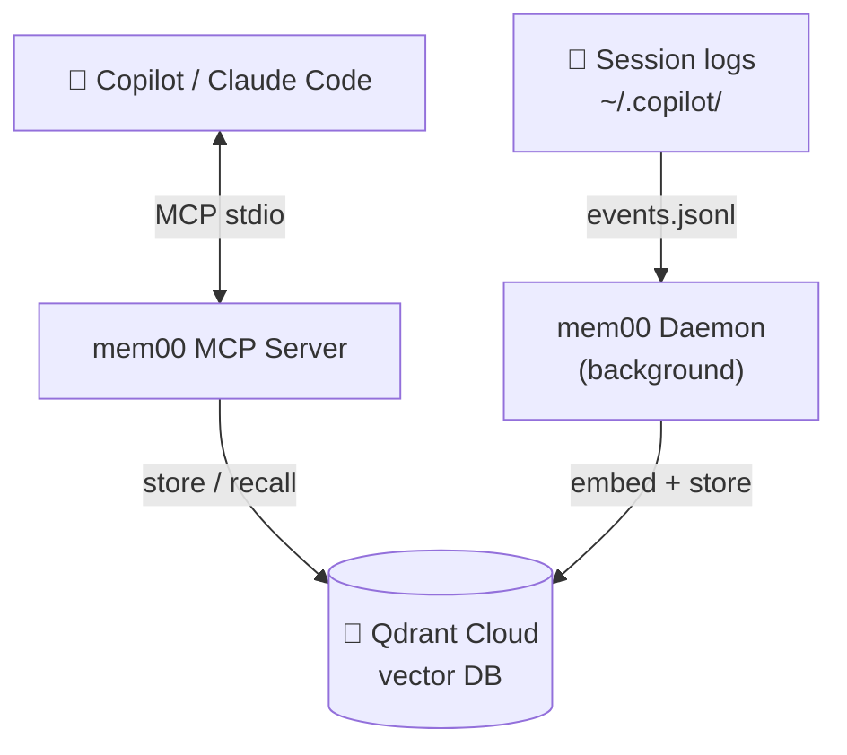
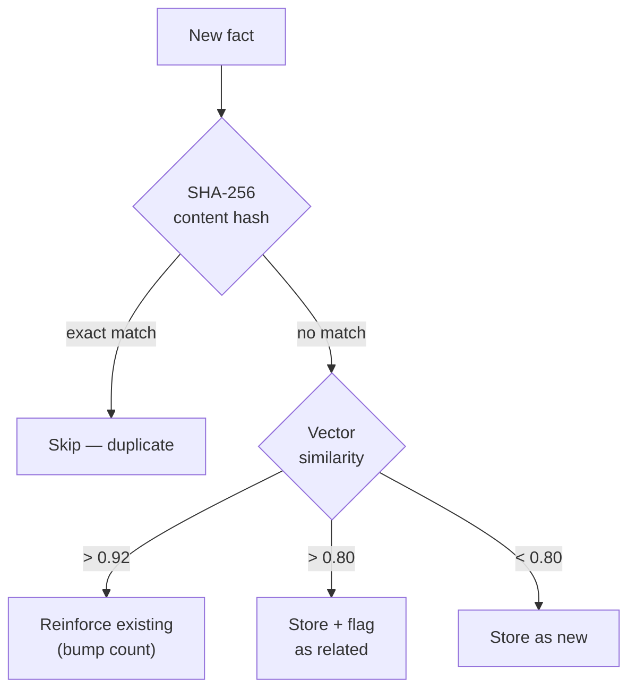
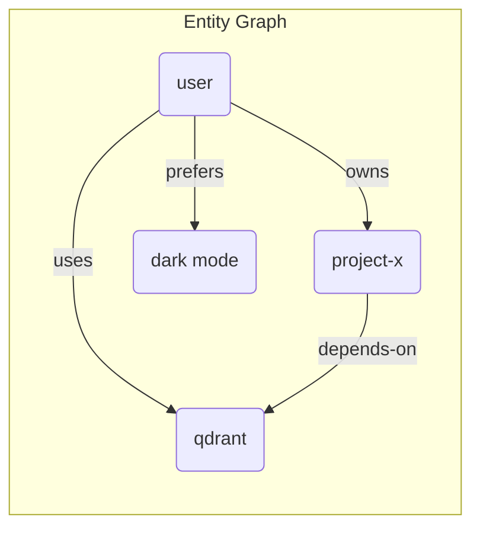
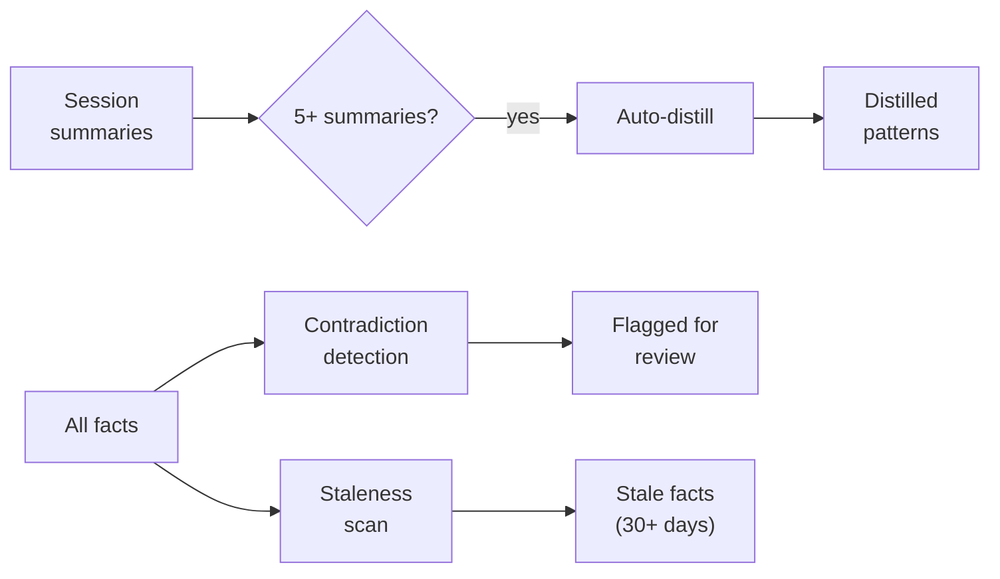

# mem00

**Shared persistent memory for AI coding sessions.**

mem00 gives your AI coding assistants (GitHub Copilot, Claude Code) long-term memory that persists across sessions. Facts, decisions, architecture knowledge, and entity relationships are stored in a vector database and recalled automatically.

---

## Why mem00 exists

Every engineering team builds institutional knowledge — the kind that doesn't live in documentation. Why that config value is what it is. Which deploy steps to run in which order. What broke last quarter and how it was fixed. Who owns what.

This knowledge lives in people's heads, scattered across chat threads, and buried in closed PRs. When someone switches projects or leaves, it's gone. It's the most valuable and least durable asset a technical organisation has.

### AI agents amplify the problem

AI coding agents are a force multiplier — teams ship more, explore more solutions, and touch more of the codebase than ever before. But that also means more decisions, more discoveries, and more institutional knowledge generated per day than any team can track manually. Some teams maintain hand-written knowledge bases to give agents context, but these drift quickly and become another thing to keep up to date. The knowledge that matters most — the things learned *during* sessions — still vanishes when the session closes.

### Knowledge that compounds

mem00 captures what agents learn during coding sessions and makes it available to every future session — for every team member — automatically. No manual documentation. No wikis to maintain.

When one engineer's agent figures out a workaround for a tricky edge case, every agent on the team knows it from their next session onward. Each team member is amplified with the experience gathered by every other member. The 50th session on a codebase is dramatically more effective than the 1st — not because of better prompts, but because of accumulated institutional memory.

### Self-curating

Raw accumulation creates noise. mem00 curates knowledge automatically:

- **Deduplication** — identical or near-identical facts are merged, not duplicated
- **Confidence decay** — old facts gradually lose weight and surface for review instead of being treated as gospel
- **Contradiction detection** — new facts that conflict with existing ones replace them, not silently coexist
- **Distillation** — recurring patterns across sessions are consolidated into higher-level insights
- **Entity graph** — relationships between concepts are inferred automatically for richer recall

### Zero maintenance

mem00 is not a wiki you have to write. Facts are captured as a natural byproduct of engineering work. The curation pipeline runs autonomously. Install once, and every session gets smarter.

---

## How it works



**MCP Server** — 12 memory tools your AI assistant can call directly:
- `memory_store` / `memory_recall` — store and search facts
- `memory_entity` / `memory_relations` — entity knowledge graph
- `memory_forget` / `memory_verify` — lifecycle management
- `memory_session_summary` / `memory_distill` — session consolidation
- `memory_heartbeat` — periodic reflection nudges

**Daemon** — background process that passively reads session logs:
- Watches `~/.copilot/session-state/` for new events
- Extracts facts via LLM from conversation transcripts
- Runs consolidation (distillation, contradiction detection)
- Infers entity relationships from co-occurring facts
- Scans for stale facts that need verification

## Quick start

```bash
# Install globally
npm install -g @sabz00/mem00

# Add to your editor's MCP config
mem00 install

# That's it — restart your editor and the memory tools appear
```

### Prerequisites

1. **Qdrant Cloud** (free tier: 1GB, no credit card)
   - Sign up at [cloud.qdrant.io](https://cloud.qdrant.io)
   - Create a cluster → copy the REST URL and API key

2. **Embedding provider** (one of):
   - **Ollama** (default, runs locally, free) — `brew install ollama && ollama pull qwen3-embedding:0.6b`
   - **OpenAI** — set `OPENAI_API_KEY` env var
   - **AWS Bedrock** — configure AWS credentials

### Setup

After installing, configure your Qdrant credentials. You can either:

**Option A** — Let your AI assistant do it:
```
> Call configure_credentials with my Qdrant URL and API key
```

**Option B** — Edit config directly:
```bash
cat > ~/.mem00/config.json << 'EOF'
{
  "qdrant_url": "https://your-cluster.cloud.qdrant.io:6333",
  "qdrant_api_key": "your-api-key-here"
}
EOF
```

**Option C** — Environment variables:
```bash
export QDRANT_URL="https://your-cluster.cloud.qdrant.io:6333"
export QDRANT_API_KEY="your-api-key-here"
```

## Configuration

Config lives at `~/.mem00/config.json`. Resolution order: **defaults → config file → env vars** (highest wins).

### Qdrant (required)

| Setting | Env var | Default | Description |
|---------|---------|---------|-------------|
| `qdrant_url` | `QDRANT_URL` | *none — must be set* | Qdrant REST URL, e.g. `https://abc123.cloud.qdrant.io:6333` |
| `qdrant_api_key` | `QDRANT_API_KEY` | *none — must be set* | Qdrant API key from cluster dashboard |
| `collection` | `MEM00_COLLECTION` | `mem00` | Collection name. Change only if running multiple instances |

### Embedding & LLM providers

Both `embedding.provider` and `llm.provider` accept exactly one of three values:

| Value | What it is | Auth needed | `base_url` used? |
|-------|-----------|-------------|-----------------|
| `ollama` | Local Ollama server | None | ✅ default `http://localhost:11434` |
| `openai` | OpenAI-compatible API | `api_key` or `OPENAI_API_KEY` | ✅ default `https://api.openai.com/v1` |
| `bedrock` | AWS Bedrock | AWS credentials (env or IAM role) | ❌ uses AWS SDK |

> **⚠️ Only these three values are valid.** Any other value will cause a silent fallback to Ollama.

### Embedding config

| Setting | Env var | Default |
|---------|---------|---------|
| `embedding.provider` | `EMBEDDING_PROVIDER` | `ollama` |
| `embedding.model` | `EMBEDDING_MODEL` | `qwen3-embedding:0.6b` |
| `embedding.dimensions` | `EMBEDDING_DIMENSIONS` | `1024` |
| `embedding.base_url` | `EMBEDDING_BASE_URL` | `http://localhost:11434` |
| `embedding.api_key` | `OPENAI_API_KEY` | — |

**Models by provider:**

| Provider | Recommended models | Dimensions |
|----------|-------------------|------------|
| `ollama` | `qwen3-embedding:0.6b`, `nomic-embed-text` | `1024`, `768` |
| `openai` | `text-embedding-3-small`, `text-embedding-3-large` | `1536`, `3072` |
| `bedrock` | `amazon.titan-embed-text-v2:0` | `1024` |

> **⚠️ `dimensions` must match your model's output.** Mismatched dimensions will cause Qdrant insert errors. If you change the model, update dimensions too.

### LLM config (used by daemon for extraction & consolidation)

| Setting | Env var | Default |
|---------|---------|---------|
| `llm.provider` | `LLM_PROVIDER` | `ollama` |
| `llm.model` | `LLM_MODEL` | `qwen2.5:7b` |
| `llm.base_url` | `LLM_BASE_URL` | `http://localhost:11434` |
| `llm.api_key` | `OPENAI_API_KEY` | — |
| `llm.bedrock_region` | `AWS_BEDROCK_REGION` | `us-east-1` |

**Models by provider:**

| Provider | Recommended models |
|----------|-------------------|
| `ollama` | `qwen2.5:7b`, `llama3.1:8b`, or any local model |
| `openai` | `gpt-4.1-mini`, `gpt-4.1` |
| `bedrock` | `anthropic.claude-3-5-haiku-20241022-v1:0` |

> `llm.bedrock_region` falls back to `AWS_REGION` if `AWS_BEDROCK_REGION` is not set.

### Provider auth quick-reference

| Provider | What to set |
|----------|------------|
| `ollama` | Nothing — just have Ollama running locally (`ollama serve`) |
| `openai` | `OPENAI_API_KEY` env var **or** `"api_key": "sk-..."` in the embedding/llm config block |
| `bedrock` | `AWS_ACCESS_KEY_ID` + `AWS_SECRET_ACCESS_KEY` env vars, or an IAM instance role |

### Copy-paste examples

**Ollama (default — zero config):**
```json
{
  "qdrant_url": "https://your-cluster.cloud.qdrant.io:6333",
  "qdrant_api_key": "your-key"
}
```

**OpenAI embeddings + LLM:**
```json
{
  "qdrant_url": "https://your-cluster.cloud.qdrant.io:6333",
  "qdrant_api_key": "your-key",
  "embedding": {
    "provider": "openai",
    "model": "text-embedding-3-small",
    "dimensions": 1536,
    "api_key": "sk-..."
  },
  "llm": {
    "provider": "openai",
    "model": "gpt-4.1-mini",
    "api_key": "sk-..."
  }
}
```

**AWS Bedrock:**
```json
{
  "qdrant_url": "https://your-cluster.cloud.qdrant.io:6333",
  "qdrant_api_key": "your-key",
  "embedding": {
    "provider": "bedrock",
    "model": "amazon.titan-embed-text-v2:0",
    "dimensions": 1024
  },
  "llm": {
    "provider": "bedrock",
    "model": "anthropic.claude-3-5-haiku-20241022-v1:0",
    "bedrock_region": "us-east-1"
  }
}
```

### Daemon settings

| Setting | Default | Description |
|---------|---------|-------------|
| `daemon.tick_interval_sec` | `5` | Seconds between daemon loop ticks |
| `daemon.extract_every_sec` | `300` | Seconds between extraction runs |
| `daemon.extract_min_events` | `5` | Minimum session events before triggering extraction |
| `daemon.consolidation_enabled` | `true` | Auto-distill session summaries into patterns |
| `daemon.relation_inference_enabled` | `true` | Infer entity relationships via LLM |
| `daemon.staleness_threshold_days` | `30` | Days before a fact is flagged as stale |

### Watcher settings

| Setting | Default | Description |
|---------|---------|-------------|
| `watchers.copilot.enabled` | `true` | Watch GitHub Copilot session logs |
| `watchers.copilot.path` | `~/.copilot/session-state` | Path to Copilot session directory |
| `watchers.claude.enabled` | `false` | Watch Claude Code project logs |
| `watchers.claude.path` | `~/.claude/projects` | Path to Claude Code projects directory |

## CLI Commands

```bash
mem00 mcp       # Start MCP server (stdio) — used by editors
mem00 setup     # Interactive setup wizard
mem00 status    # Check memory system status
mem00 install   # Write MCP config for Copilot + Claude Code
```

## Memory architecture

### Deduplication

Two-layer dedup prevents bloat:



### Ranking formula
Facts are ranked using a combined score:
```
(vectorScore × 0.55 + freshness × 0.15 + reinforcement × 0.1 + importance × 0.1)
  × (0.7 + 0.3 × confidenceDecay)
```

### Entity knowledge graph

Facts mentioning multiple entities build an implicit graph:



The daemon periodically:
1. Scrolls all facts → builds entity co-occurrence map
2. For top pairs by shared-fact count → LLM infers relationship type
3. Stores typed edges (e.g., `user --[owns]--> project-x`)

### Consolidation pipeline



- **Auto-distill** — merges 5+ session summaries into distilled patterns
- **Contradiction detection** — flags conflicting facts for review
- **Category rebalancing** — consolidates oversized categories
- **Staleness scanning** — surfaces facts that haven't been verified in 30+ days

## License

AGPL-3.0 — see [LICENSE](LICENSE).
