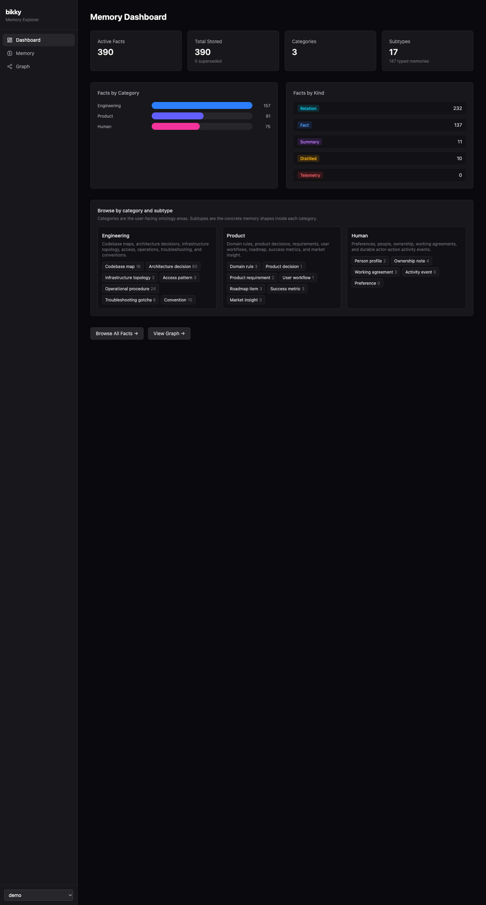
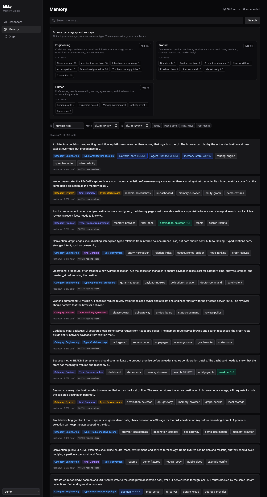
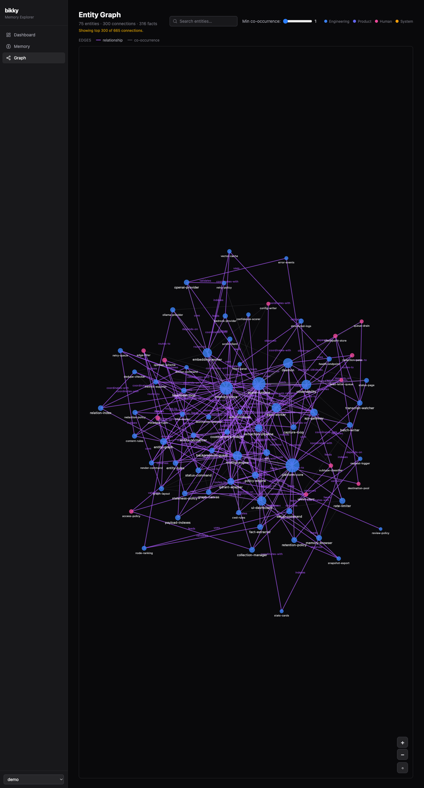

<h1 align="center">bikky</h1>

<p align="center"><b>Persistent memory for AI coding agents — built for teams and multi-agent engineering workflows.</b></p>

bikky gives AI coding agents (GitHub Copilot, Claude Code, Cursor, and other MCP clients) long-term memory that persists across sessions, across tools, and across your whole team. When multiple engineers, agents, or repos need to build on the same knowledge base, bikky captures what's learned *during* sessions so future sessions start smarter.

### Who it's for

- 👥 **Teams & software factories** — What one engineer's agent learns today, every agent on the team can recall tomorrow. Shared memory turns institutional knowledge into something queryable instead of tribal — onboarding accelerates, conventions stop drifting, and the same lesson never gets re-learned twice.
- 🤖 **Multi-agent engineering workflows** — Multiple Cursor / Claude Code / Copilot sessions can share codebase context, conventions, and recent decisions instead of re-learning them from scratch.

<p align="center">
  
</p>

<p align="center"><i>Knowledge flows from every session into a store that curates itself over time — deduplicating, distilling, and decaying stale facts — so every future session starts smarter across the team.</i></p>

---

### The problem

The most valuable things you and your agents learn — why a config value exists, which deploy step matters, what broke last quarter, the convention you settled on yesterday — happen *during* sessions. And then they vanish when the session closes. Across teams, repos, and tools, knowledge still lives in heads, chat threads, and closed PRs, and every new agent session has to learn it from scratch. Hand-written docs drift the moment they're published.

### How bikky solves it

bikky gives your agent memory tools and runs a small background service after `bikky setup`. You keep working normally; bikky captures useful facts, organizes them, recalls them in future sessions, and keeps the store tidy over time.

- **Capture** — Facts are extracted automatically from session transcripts; no manual docs to write.
- **Classify** — Memories are grouped as **engineering**, **product**, **human**, or **system** so they stay easy to browse and filter.
- **Recall** — Every new session, yours or a teammate's, recalls from the same store via semantic search.
- **Curate** — bikky merges duplicates, fades stale facts, resolves contradictions, distills recurring patterns, and builds an entity graph over time.
- **Compound** — Session 50 is dramatically better than session 1 because memory accumulates.
- **Route** — Optionally keep team, client, or environment-specific memory in separate Qdrant destinations from one install. See [separate memory stores](#optional-separate-memory-stores).

Subtypes keep recall precise without making setup harder:

- **Engineering** — codebase maps, architecture decisions, infra topology, access patterns, operational procedures, troubleshooting gotchas, and conventions.
- **Product** — domain rules, product decisions, requirements, user workflows, roadmap items, success metrics, and market insights.
- **Human** — preferences, person profiles, ownership notes, working agreements, and activity events.
- **System** — session indexes, episodes, workstreams, and feedback signals.

---

## Quick start

This is the fastest path to a working memory store: Qdrant runs locally, while hosted embeddings and LLM calls provide strong extraction and recall quality without running local models.

```bash
# 1. Pull and run Qdrant (vector store)
docker run -d --name qdrant -p 6333:6333 -v qdrant_storage:/qdrant/storage qdrant/qdrant

# 2. Install bikky
npm install -g bikky
mkdir -p ~/.bikky
# Replace sk-... below with your hosted model API key.
cat > ~/.bikky/config.json <<'JSON'
{
  "qdrant_url": "http://localhost:6333",
  "qdrant_api_key": "",
  "embedding": {
    "provider": "openai",
    "model": "text-embedding-3-small",
    "dimensions": 1536,
    "api_key": "sk-..."
  },
  "llm": {
    "provider": "openai",
    "model": "gpt-4.1-mini",
    "api_key": "sk-..."
  }
}
JSON
# qdrant_api_key is optional; leave it empty or omit it for local Qdrant.
# Prefer env vars? Omit api_key above and set OPENAI_API_KEY instead.

# 3. Register bikky with your editor and start the background service
bikky setup            # writes MCP config for Copilot + Claude Code, then starts the daemon
```

`npm install -g bikky` runs a best-effort postinstall setup hook for convenience. It never fails the install, and you should still run `bikky setup` after writing your config to make setup explicit and repeatable.

Restart your editor. The memory tools appear automatically in supported MCP clients.

```bash
bikky status           # confirms Qdrant, embeddings, daemon, and UI health
```

That's it. You can keep Qdrant local forever, or move the vector store to Qdrant Cloud later for a shared team setup.

For other deployment shapes — fully hosted, 100% local, or hosted Qdrant with local models — see [Setup options](#setup-options).

---

## Setup options

bikky supports four common setup shapes. Pick based on where you want Qdrant to run and where model calls should happen.

### What you need

| Component               | Required                       | Options                                                                                  |
| ----------------------- | ------------------------------ | ---------------------------------------------------------------------------------------- |
| **Node.js**             | ≥ 20                           | `nvm install 20` or your package manager                                                 |
| **Vector store**        | Qdrant                         | Local Docker · [Qdrant Cloud](https://cloud.qdrant.io) · Self-hosted                     |
| **Embeddings**          | One provider                   | OpenAI · Ollama · Bedrock · Portkey                                                     |
| **LLM**                 | One provider                   | OpenAI · Ollama · Bedrock · Portkey                                                     |
| **Docker** *(optional)* | Only if you run Qdrant locally | Docker Desktop, OrbStack, colima, etc.                                                   |

Both `embedding.provider` and `llm.provider` accept the same values: `ollama`, `openai`, `bedrock`, or `portkey`.

> ⚠️ **Qdrant Cloud free tier does not include automatic backups.** Deleted collections cannot be recovered. If your memory data is valuable, use a paid Qdrant Cloud plan (which includes daily backups), run Qdrant locally with your own backup strategy, or periodically export snapshots via the [Qdrant snapshots API](https://qdrant.tech/documentation/concepts/snapshots/).

### Choose a setup

| Setup                            | Best for                                                       | Config                                                                    |
| -------------------------------- | -------------------------------------------------------------- | ------------------------------------------------------------------------- |
| **Fully hosted**                 | Best performance and teams; managed vector storage and models  | [Fully hosted config][fully-hosted-config]                              |
| **Local Qdrant + hosted models** | Local vector storage with hosted extraction and embedding      | [Hosted models config][hosted-models-config]                            |
| **Local and free**               | Local evaluation; quality depends on local models              | [Local config guide][local-config]                                      |
| **Hosted Qdrant + local Ollama** | Shared vector storage while keeping model calls local          | [Hosted Qdrant + local models][hosted-qdrant-local-models-config]       |

### Configuration basics

Pick the setup guide above for the copy-paste config. All setup shapes use the same three building blocks:

- **Qdrant** — where vectors and memory payloads are stored.
- **Embeddings** — how facts become searchable vectors.
- **LLM** — how session transcripts are extracted, curated, and distilled.

Config lives at `~/.bikky/config.json`, or at `BIKKY_HOME/config.json` when `BIKKY_HOME` is set. You can keep credentials out of the file with environment variables such as `QDRANT_URL`, `QDRANT_API_KEY`, and provider API keys.

For hosted models, custom providers, multiple profiles, or advanced tuning, use the full configuration guide.

> 📖 **Full configuration guide:** [docs/configuration.md][configuration-guide]
>
> 🛠 Want to add a new embedding or LLM provider (Vertex, OpenRouter, etc.)? See **[CONTRIBUTING.md][contributing]** — it's a single-file change.

#### Optional: separate memory stores

Most installs use one Qdrant destination. If you need clean separation later, replace the single `qdrant_url` / `collection` fields with named `destinations[]`:

```jsonc
{
  "destinations": [
    {
      "name": "platform",
      "description": "Shared platform engineering memory.",
      "qdrant_url": "https://platform.cloud.qdrant.io:6333",
      "qdrant_api_key": "...",
      "collection": "bikky-platform",
      "default": true
    },
    {
      "name": "client-a",
      "description": "Client A project memory.",
      "qdrant_url": "https://client-a.cloud.qdrant.io:6333",
      "qdrant_api_key": "...",
      "collection": "bikky-client-a"
    }
  ],
  "default_search_scope": "routed"
}
```

That is enough for explicit selection in the UI and tools. Add routing rules only when you want automatic placement by cwd, entity, content, or metadata. Search tools can also use `search_scope: "all"` or a named/listed scope when context may span stores. Existing single-Qdrant configs continue to work.

> 📖 **Details:** [multi-destination configuration](docs/configuration.md#multi-destination-routing)

[fully-hosted-config]: https://cdn.jsdelivr.net/npm/bikky@latest/docs/config/fully-hosted.md
[hosted-models-config]: https://cdn.jsdelivr.net/npm/bikky@latest/docs/config/hosted-models.md
[local-config]: https://cdn.jsdelivr.net/npm/bikky@latest/docs/config/local.md
[hosted-qdrant-local-models-config]: https://cdn.jsdelivr.net/npm/bikky@latest/docs/config/hosted-qdrant-local-models.md
[configuration-guide]: https://cdn.jsdelivr.net/npm/bikky@latest/docs/configuration.md
[contributing]: https://cdn.jsdelivr.net/npm/bikky@latest/CONTRIBUTING.md

---

## Web UI

[`bikky-ui`](https://www.npmjs.com/package/bikky-ui) is a local dashboard for browsing and managing your team's memory — facts, entities, quality metrics, aggregate impact insights, and the relationship graph.

```bash
npx bikky-ui          # one-shot — no install needed
# or install globally
npm install -g bikky-ui
bikky-ui              # opens http://localhost:1422
```

<p align="center">
  
</p>
<p align="center"><i>Dashboard — memory stats, category breakdown, and recent facts at a glance</i></p>

<p align="center">
  
</p>
<p align="center"><i>Memory browser — search, filter by category/kind/source, and browse all stored facts</i></p>

<p align="center">
  
</p>
<p align="center"><i>Entity graph — interactive visualization of how concepts, people, and services relate</i></p>

The UI reads from your existing `~/.bikky/config.json` (or `BIKKY_HOME/config.json`) — no extra configuration required.

## CLI

```bash
bikky mcp       # start MCP server (stdio) — used by editors
bikky setup     # install MCP configs for Copilot + Claude Code, then start the daemon
bikky start     # alias for setup
bikky stop      # stop the background daemon
bikky daemon    # run the daemon in the foreground
bikky status    # check memory system health
bikky ui        # launch the local web dashboard
bikky render    # render a prompt to JSON (for eval harnesses & debugging)
```

`bikky status` is the first thing to run when setup feels wrong. It checks the config, Qdrant, embeddings, background daemon, and local UI health, then tells you what needs attention. Use `bikky status --json` for automation.

## Privacy and transcript capture

bikky stores memory in the Qdrant destination you configure. The daemon runs locally and reads supported coding-agent transcript locations so it can extract durable facts for future sessions:

- GitHub Copilot session state: `~/.copilot/session-state`
- Claude Code project transcripts: `~/.claude/projects`

Only the configured daemon process reads these files. Extracted facts are redacted before storage, but they are still sent to your configured LLM provider for extraction unless you use a local provider such as Ollama. To disable transcript capture, set the relevant watcher to `false` in `~/.bikky/config.json`:

```json
{
  "watchers": {
    "copilot": { "enabled": false },
    "claude": { "enabled": false }
  }
}
```

You can also set `daemon.extract_every_sec` to `0` to disable background extraction while keeping MCP recall tools available.

## License

AGPL-3.0 — see [LICENSE](LICENSE).
