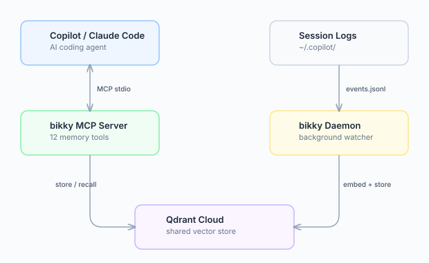

<h1 align="center">bikky</h1>

<p align="center"><b>Persistent memory for AI coding agents — for solo power users and teams.</b></p>

bikky gives AI coding agents (GitHub Copilot, Claude Code, Cursor, Codex, and other MCP clients) long-term memory that persists across sessions, across tools, and — when you want it — across your whole team. Whether you're a solo power dev running a dozen agentic sessions a day, or a team that wants every engineer's agent to start from the same knowledge base, bikky captures what's learned *during* sessions so future sessions start smarter.

### Who it's for

| | |
|---|---|
| 🧑‍💻 **Solo AI power devs** | You run multiple Cursor / Claude Code / Copilot / Codex sessions every day and you're tired of re-explaining the codebase, the conventions, and last week's decisions to each new agent. bikky remembers across every session and every tool. |
| 👥 **Teams & software factories** | What one engineer's agent learns today, every agent on the team can recall tomorrow. Shared memory turns institutional knowledge into something queryable instead of tribal. |

<p align="center">
  
</p>

<p align="center"><i>Knowledge flows from every session into a store that curates itself over time — deduplicating, distilling, and decaying stale facts — so every future session starts smarter. Use it solo, or share the workspace across a team.</i></p>

---

### The problem

The most valuable things you and your agents learn — why a config value exists, which deploy step matters, what broke last quarter, the convention you settled on yesterday — happen *during* sessions. And then they vanish when the session closes. Today's power devs run dozens of agentic sessions a day across multiple tools, and none of them remember each other; teams amplify the same problem at scale, with knowledge living in heads, chat threads, and closed PRs. Hand-written docs drift the moment they're published.

### How bikky solves it

| | |
|---|---|
| **Capture** | Facts are extracted automatically from session transcripts — no manual docs to write |
| **Recall** | Every new session — yours or a teammate's — recalls from the same store via semantic search |
| **Curate** | Deduplication, confidence decay, contradiction detection, and distillation run autonomously |
| **Compound** | Session 50 is dramatically better than session 1 — accumulated memory, not better prompts |

---

## Quick start

```bash
npm install -g bikky
bikky install          # writes MCP config for Copilot + Claude Code
```

**Prerequisites:** A Qdrant instance + an embedding provider.

- **Qdrant** — pick one:
  - [Qdrant Cloud](https://cloud.qdrant.io) (free tier, 1 GB, no credit card) — needs URL + API key.
  - **Local Docker:** `docker run -p 6333:6333 qdrant/qdrant` — URL `http://localhost:6333`, no API key.
  - **Self-hosted:** any reachable Qdrant; API key only required if you set `QDRANT__SERVICE__API_KEY` on the server.
- **Embeddings** — [Ollama](https://ollama.com) runs locally for free, or use OpenAI / AWS Bedrock / [Portkey](https://portkey.ai) gateway.

Then configure credentials — pick one:

```bash
# Option A: let your agent do it
> "Call configure_credentials with my Qdrant URL (and API key if needed)"

# Option B: config file
echo '{ "qdrant_url": "http://localhost:6333" }' > ~/.bikky/config.json
# (add "qdrant_api_key" only if your Qdrant requires auth)

# Option C: env vars
export QDRANT_URL="http://localhost:6333"
# export QDRANT_API_KEY="…"   # optional; required only for Qdrant Cloud / authenticated self-hosted
```

Restart your editor — memory tools appear automatically.

> 📖 Full configuration reference (providers, models, daemon settings): **[docs/configuration.md](docs/configuration.md)**
>
> 🛠 Want to add a new embedding or LLM provider (Vertex, OpenRouter, etc.)? See **[CONTRIBUTING.md](CONTRIBUTING.md)** — it's a single-file change.

---

## How it works

<p align="center">
  
</p>

**MCP Server** — tools your agent calls directly:

`memory_store` · `memory_recall` · `memory_entity` · `memory_relations` · `memory_forget` · `memory_verify` · `memory_heartbeat` · `memory_review` · `configure_credentials` · `verify_connection`

**Daemon** — background process that passively watches session logs, extracts ontology-v2 facts, writes lightweight session indexes, captures coherent episode summaries, updates current-state workstream summaries, infers entity relationships, and runs the consolidation pipeline. Lifecycle memory is daemon-owned so agents do not need to remember summary/distillation tool calls.

---

## Memory ontology

New daemon captures use ontology v2:

```text
workspace -> domain -> repo/project/surface -> workstream -> episode -> memory objects
```

`domain` is an activity/knowledge profile. The initial canonical domains are:

| Domain | Purpose |
|--------|---------|
| `software_engineering` | Default for coding-agent captures: repos, code, infrastructure, releases, incidents |
| `product_strategy` | Roadmap, positioning, experiments, customer insight, product decisions |
| `business_operations` | Company processes, vendors, compliance, obligations, recurring workflows |
| `research` | Source-backed investigation, hypotheses, contradictions, synthesis |
| `personal_productivity` | Individual goals, routines, preferences, projects, habits |

For `software_engineering`, canonical categories are `codebase`, `infrastructure`, `operations`, `decisions`, `product_domain`, `projects`, `people`, `preferences`, and `observations`.

`kind` stays small (`fact`, `summary`, `distilled`, `relation`, `telemetry`). More specific shape lives in `memory_subtype`, such as `codebase_map`, `architecture_decision`, `episode`, `workstream`, or `failure_mode`.

---

## Self-curation

Raw fact accumulation creates noise. bikky keeps the knowledge store clean automatically:

- **Deduplication** — content hash + vector similarity merges near-identical facts
- **Ontology scope fields** — optional `workspace_id`, repo, workstream, and episode metadata make recall more precise
- **Confidence decay** — old facts lose weight and surface for review
- **Contradiction detection** — conflicting facts are resolved, not silently stacked
- **Distillation** — recurring patterns across sessions consolidate into higher-level insights
- **Entity graph** — relationships between concepts are inferred for richer recall

---

## Web UI

[`bikky-ui`](packages/ui) is a local dashboard for browsing and managing your team's memory — facts, entities, quality metrics, aggregate impact insights, and the relationship graph.

```bash
npx bikky-ui          # one-shot — no install needed
# or install globally
npm install -g bikky-ui
bikky-ui              # opens http://localhost:1422
```

<p align="center">
  
</p>
<p align="center"><i>Dashboard — memory stats, category breakdown, and recent facts at a glance</i></p>

<p align="center">
  
</p>
<p align="center"><i>Memory browser — search, filter by category/kind/source, and browse all stored facts</i></p>

<p align="center">
  
</p>
<p align="center"><i>Entity graph — interactive visualization of how concepts, people, and services relate</i></p>

The UI reads from your existing `~/.bikky/config.json` — no extra configuration required.

## CLI

```bash
bikky mcp       # start MCP server (stdio) — used by editors
bikky setup     # interactive setup wizard
bikky status    # check memory system health
bikky install   # write MCP config for Copilot + Claude Code
bikky templates # print config snippets for Copilot, Claude Code, Cursor, and Codex
bikky render    # render a prompt to JSON (for eval harnesses & debugging)
```

See **[docs/integrations.md](docs/integrations.md)** for copy-paste MCP templates.

### `bikky render` — inspect prompts

Render any of bikky'''s prompts to JSON without booting the MCP server. Useful for
external evaluation harnesses, prompt debugging, and reproducing model calls.

```bash
bikky render --list                                    # list available prompts
echo '''{"transcript":"..."}''' | bikky render extraction  # via stdin
bikky render extraction --input case.json              # via file
```

Output: a JSON object with `promptName`, `messages`, `temperature`,
`max_tokens`, and `response_format` — exactly what bikky sends to the LLM.

## License

AGPL-3.0 — see [LICENSE](LICENSE).
